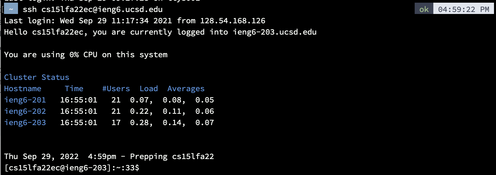
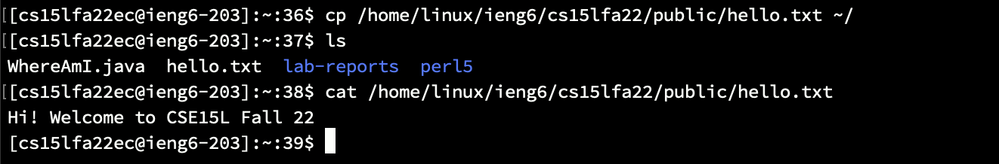
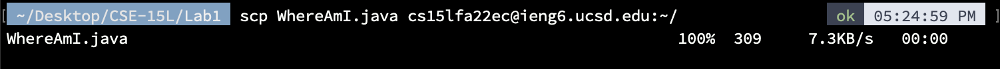
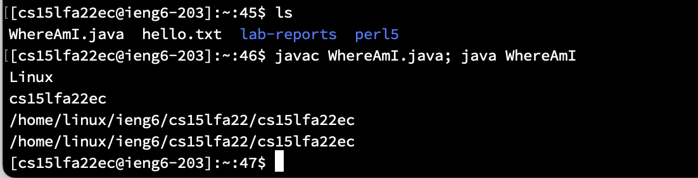

# Lab Report 1
## Step 1 - Accessing your CSE15L Account
The first step is to find your specific account for CSE15L. You can find this information at the following site:   
[Account Lookup](https://sdacs.ucsd.edu/~icc/index.php)  
Enter in your username and PID number, and you should be given your unique account. It should be of the format cs15lfa22zz, where the zz is your specific pair of letters.  
Afterwards, if this is your first time using ssh, you must set a new password. Use the Password Reset tool to set a new password, with the existing password being whatever password is used for your Single-Sign-On. When creating a new password, make sure you click to check your password before submitting, or it will not let you change the password.  
After recieving the page stating the password change was successful, you can now access the remote server. The password change can take anywhere from 2 to 40 minutes, or even longer. I eventually reset my password again while waiting, and for some reason it was authorized in only a few minutes. 

## Step 2 - Installing VSCode
Visual Studio Code can be downloaded at the following website:  
[Install VSCode](https://code.visualstudio.com/)  
Simply follow the instructions on the site, and be sure to select the version corresponding to the operating system of your computer.  
Once installed, you can exit the *Getting Started* tab, and you should be left with a screen that looks similar to the one below.  
  
Your version might look slightly different, with different icons or color scheme, but all the basic features you need are there. VSCode will let you create and edit all the files you need to, access a terminal, and includes other helpful addons.  

## Step 3 - Remotely Connecting
In this step, we will use ssh (secure shell) to log into a server from your computer, which is referred to as the local machine. If you are using a Windows operating system, you will have to install the OpenSSH client, which will let you access these types of acccounts. If using a computer with MacOS, you do not need to install this additional program.  
In VScode, you can open up a new terminal, either by using the shortcut **Command** +  **'**, or by clicking *Terminal* at the top, and then *New Terminal*. With the terminal open, type in the following command:  
`ssh cs15lfa22zz@ieng6.ucsd.edu`  
Remember to replace the zz with your specific username.  
The first time you do this, a prompt will come up asking if you are sure your want to continue logging in. Simply enter "yes", and then enter your password when prompted. Again, if you are sure the username and password were entered correctly, it may just be taking time to update the new password.  
After succesfully logging in, you should see something similar to this:  
  
You can see that I wasn't prompted to enter my password, since I set an ssh key, which will be done later on in this tutorial.  
At this point, you are connected to the server and have access to this remote computer.

## Step 4 - Running Some Commmands
In this step, we will run some basic commands to see how to access and view different files both on your local machine and the server. Since the server runs on Unix, the same commands that work on the remote server should work on your local machine if it runs MacOS. If it runs on Windows, some of the commands would be different and thus not work.  
Here are some basic commands:  
* `cd ~` - This will change your working directory back to the home directory
* `cd` - Similar to the previous command, this will take you back to the home directory
* `ls -a` - lists all of the files and folders in the current directory
* `cp /home/linux/ieng6/cs15lfa22/public/hello.txt ~/` - this will copy a file from the public subfolder in the cs15lfa22 folder. In this case, it grabbed **hello.txt**.
* `cat /home/linux/ieng6/cs15lfa22/public/hello.txt` - cat will print the contents of whichever file is specified in the path, which in this case was hello.txt.  
  

To log out of the remote server, you can either:  
* Type **Command** + **d**
* enter `exit`

## Step 5 - Moving Files Using scp
In this step we will learn how to transfer files over ssh back and forth between your local machine and the server. First we will copy a file from the client, which is your computer, to the server using the `scp` command. `scp` is always run on the client, and it does not require you to be logged into the remote server, although you will need to enter the password for it to go through.  
Open a new terminal on your local computer. You can either open one side-by-side on VSCode, or use the built-in terminal on your computer. Create a file on the client called WhereAmI.java with the following contents:  
```
class WhereAmI {
  public static void main(String[] args) {
    System.out.println(System.getProperty("os.name"));
    System.out.println(System.getProperty("user.name"));
    System.out.println(System.getProperty("user.home"));
    System.out.println(System.getProperty("user.dir"));
  }
}
```  
You can compile the java file with the command:  
`javac WhereAmI.java`  
and then run the file with the command:  
`java WhereAmI`  
What you should see is the operating system, user name, the path of your home directory, and the path of your current directory of the **client** listed out.  
In the same terminal, type the following command  
`scp WhereAmI.java cs15lfa22zz@ieng6.ucsd.edu:~/`  
Remember to replace "zz" with your username. At this point, you should be prompted to enter your password for ssh login. After entering it, you should see something similar to the following:  
  
Again, since I created an ssh key, it did not prompt me to enter a password, but everything else should be the same.  
Now if you logged back into your ssh account, or went back to the first terminal, and typed `ls`, you should see *WhereAmI.java* listed. Go ahead and compile and run the file with the same commands. Notably, the operating system should be "Linux", and the two directories should be identical, since the home directory is the current working directory. 

## Step 6 - Setting up an ssh key
As mentioned previously, setting up an ssh key will allow you to log in to the server and use the `scp` command without needing to enter your password each time. To do this we will create a pair of files, one which is stored on the client and one on the server, which are called the *private key* and *public key* respectively. The `ssh-keygen` program creates these files, which will save a lot of time when working on projects.  
First enter the following command on the client  
`ssh-keygen`  
When prompted for which file to save the key in, enter  
`<client home directory>/.ssh/id_rsa`  
When prompted to enter the passphrase, you can just hit **Enter** and do the same when asked to enter it again. This will essentially be empty so there would be no passphrase. A unique key fingerpring and image will appear on the terminal. We now need to copy the public key from the `.ssh` folder on the client into the `.ssh` folder of the server.  
First log in using ssh. On the server, use the following command  
`mkdir .ssh`  
Then exit out of ssh. We will now use `scp` to copy the public key file. 
`scp <client home directory>/.ssh/id_rsa.pub cs15lfa22zz@ieng6.ucsd.edu:~/.ssh/authorized_keys`  
Again, remember to replace "zz" with your username. After doing this, you should be able to `ssh` and `scp` without need to enter a password, like so:  
  

## Step 7 - Optimizing Remote Running
Now that everything is set up, here are some tips to make editting and transfering files between server and client a little smoother.  
* You can place a command in quotes after an `ssh` login to have that command immediately run  
`ssh cs15lfa22zz@ieng6.ucsd.edu "ls"`  
* You can use the **up** arrow to copy the previous command into the prompt, in case you need to redo and make a small edit to a previous command.
* You can run multiple commands at once if you separate them by semicolons. They will be executed one by one in the order listed.  
  

Using these tips, you should be able to tranfer and edit files with far less keystrokes and mouse-clicks. 