# Lab Report 2
## Part 1 - Search Engine Server
This is the code I have so far for the Search Engine Server page.
```
import java.io.IOException;
import java.net.URI;
import java.util.ArrayList;
import java.util.*;

class Handler implements URLHandler {
    // The one bit of state on the server: a number that will be manipulated by
    // various requests.
    int num = 0;

    public String handleRequest(URI url) {
        ArrayList<String> list = new ArrayList<String>();
        ArrayList<String> print_list = new ArrayList<String>();
        if (url.getPath().equals("/")) {
            return String.format("Server was started, you can add or search.");
        } else if (url.getPath().equals("/add")) {
            String parameters[] = url.getQuery().split("="); //
            if (parameters[0].equals("s")) {
                list.add(parameters[1]);
                return String.format(parameters[1]+" was added.");
            }
        } else {
            System.out.println("Path: " + url.getPath());
            if (url.getPath().contains("/search")) {
                String parameters[] = url.getQuery().split("=");
                if (parameters[0].equals("s")) {
                    String test = parameters[1];
                    System.out.println(test);
                } 
                /*
                if (parameters[0].equals("count")) {
                    num += Integer.parseInt(parameters[1]);
                    return String.format("Number increased by %s! It's now %d", parameters[1], num);
                }
                */
            }
            return "That substring was not found!";
        }
        return "404 Not Found!";
    }
}
class SearchServer {
    public static void main(String[] args) throws IOException {
        if(args.length == 0){
            System.out.println("Missing port number! Try any number between 1024 to 49151");
            return;
        }

        int port = Integer.parseInt(args[0]);

        Server.start(port, new Handler());
    }
}
```
When the server is first started, this is the what the browser displays, including the URL.
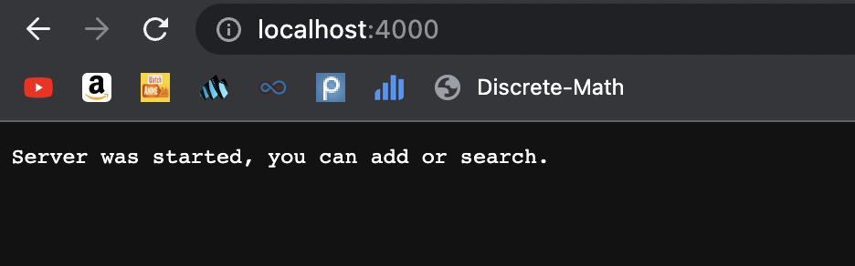
There are no paths in the URL, and the browser only displays a simple message stating that the server started. From the code, this implements the `getPath` method of URI to get the path of the url. In this case, it was coded that if the path is only `/`, or basically that there is no path, it should display a start message. 
The next feature that is implemented is adding an element. In this example, I added the String "apple". 
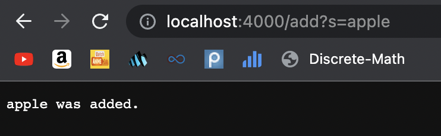
To do this, the path was `add?s=apple`. The `add` being included as part of the path indicates to the code that a new element will be added. It then uses the `getQuery` method of URI split by "=" to indicate what the actual input will be. The element is added essentially by passing the string into an array of strings. The code checks that the first element after the query split is `s`. If so, whatever comes after the split is taken as input for the next array element. In this case, that element is "apple" which is taken in as `parameters[1]`. A message is also displayed after this url with this path is called, displaying whatever string was inputted.
Whenever an add path is called, the input to `parameters[1]` is added to an ArrayList of Strings, which act as a database of all the added elements so far. This way, when a search query path is called, the code could look through this List and perform any necessary comparisons to return the correct values. 
Here is an example of another element being added, in this case "pineapple".
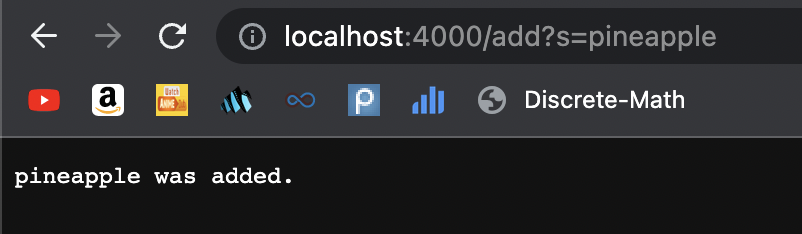
Again, to add this string, it was passed into the path of `add` denoting that if the first element after the `?` is an "s", then the next string split by the `s` using "=" is the string to add. In this case, `parameters[1]` was the string "pineapple", and this was also added to the list of added strings along with "apple."
The next feature is searching for an added element. 
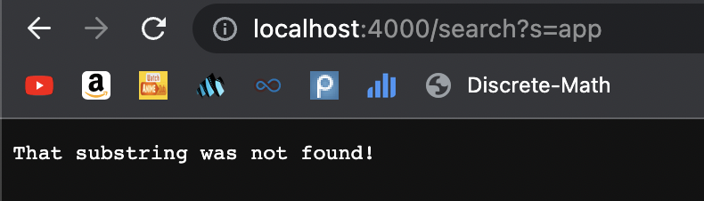
Search works by using the path `/search?` followed by `s=<string>` where `<string>` is a string. The browser should then display all of the added elements where the string appears somewhere in them. Or more plainly, all the added elements that the string is a substring of. Like with add, the code uses the `getQuery` method of URI to see if the path is `/search`, executing the body of the if-statement if so. Just like with add, elements are passed in through an array, where if the first element after the `q` query is "s", then the next string split by a "=" is the string to search for. This string is inputted as `parameters[1]`, and then the code should look through each element in the List of added value to see if the string is a substring of any of them. 
Searching for the string "app" after the strings "apple" and "pineapple" were added, the browser should display both "apple" and "pineapple" since "app" is a substring of both. However, I have some sort of bug in my code that causes this to fail. It only displays an output message placed at the end of the if-statement, if the substring was not found at all (which would be the symptom of this bug). As of now, I think the bug is either that the final return statement is the only thing being displayed, because it is last, or that the function I currently have to iterate through the List of added elements and check if the substring exists in any of the elements isn't working as I intended. I am continuing to work on this bug, so hopefully I will figure out what the fix is.  


## Part 2 - Fixing Bugs
Two of the bugs we were able to fix were from the ArrayTests and ListsTests files. 
### Array Tests Bug
The first bug we worked on was fixing the first method of ArrayTests, which called the `reverseInPlace` function from ArrayExamples. The failure-inducing input I tested was the array {1,2,3,4}. 
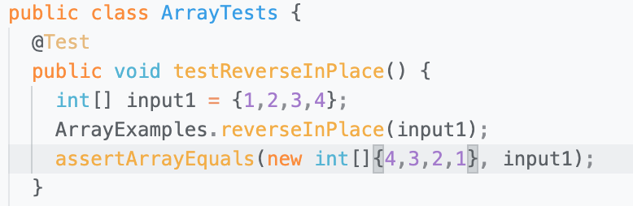.
Running the tests in ArrayTests using JUnit, this was the following output. 
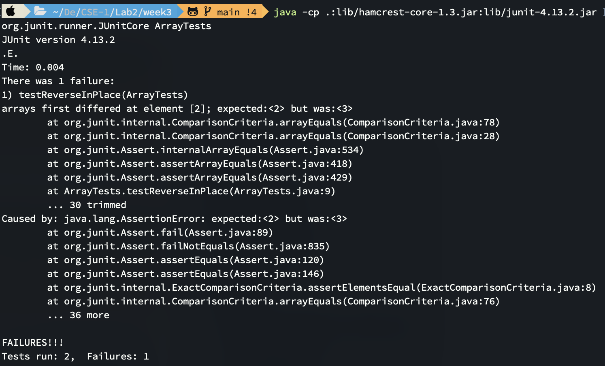
As we can see, of the two tests that ran, one of them resulted in a failure. The `testReverseInPlace` test failed as the output had an element of 3 in the place where it was supposed to have an element of 2. Upon several other tests to confirm, we realized that the bug in the code was that after the midpoint of the array being iterated through, the swapping of elements to reverse the array was no longer taking place. Due to this bug, the entire array would not be reversed accurately, and so when the test was run, it failed since some of the elements were not the same as their expected counterparts. 
To fix this bug, we instead changed the condition of the iterating loop to go up to but not including half of the array, and also storing each of those valid values in a separate variable. This way, all the indexes from before the midpoint are value, and their corresponding "reverse" index will take on the value that was there. 
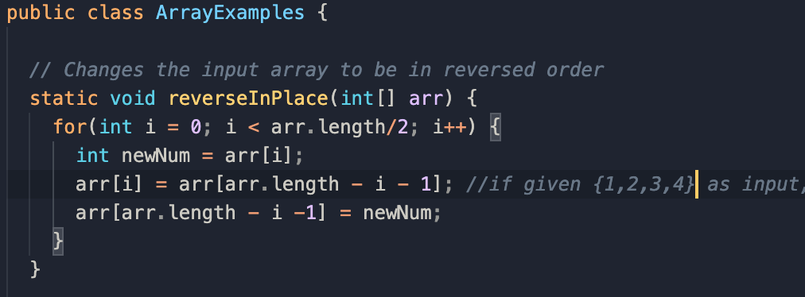
After implementing the fix, this was the output: 
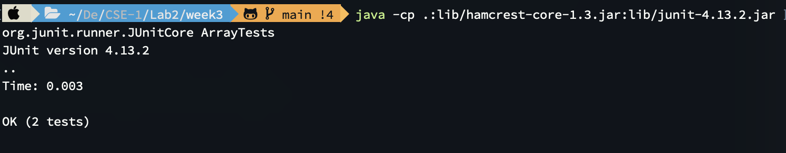
As we can see, both tests ran succesfully, meaning fixing this bug allowed the array to be reversed successfully, and it matched the expected array. 

### List Tests Bug
Another bug we worked on was the secodn function in ListExamples, the`merge`. After creating the ListTests.java file to run some tests on these methods, this was the function I came up with to test the `merge` method. 
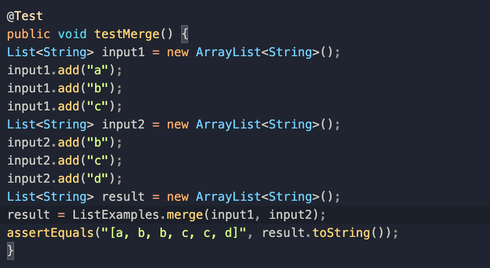
The method was fairly simple, it created two Lists of string values, one with `"a", "b", "c"` and the other with `"d", "e", "f"`, and then called the `merge` method from ListExamples, passing both as inputs. Since the function is supposed to combine both into one List in sorted order, the expected result should be `"a", "b", "c", "d", "e", "f"`. To make it easier to compare to the expected output, and because I was not very confident with JUnit, I converted both the expected result and the result from `merge` to strings for the sake of comparing. 
After running the tests in ListTests.java, the test took a long time to complete, with my terminal noting it took 14 seconds (compared to the 0.04 from previous tests). It noted that there was a test that failed, giving the following symptoms: 
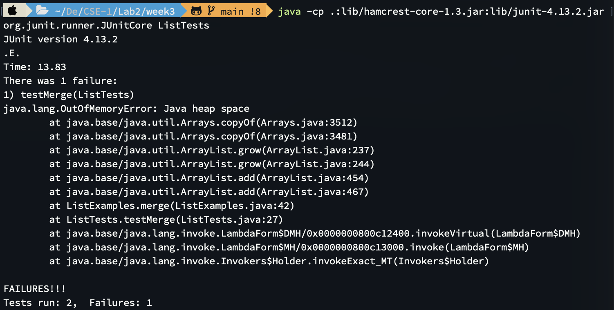
The reason is says 2 tests run is because I had placed a simple dummy test in the same Test files just to make sure I had created a JUnit test properly. Since the ouput said "OutOfMemoryError: Java heap space", my immediate first thoughts were that there was somehow a infinite loop in the code, as that might explain why it took so long. Either way, there was some bug in the code that led to this failure ouput. 
It didn't take long to find the bug in the code, as we noticed that in one of the while loops, the wrong index was being incremented. 
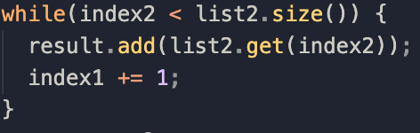
Instead of `index2`, the code increments `index1` which leads to the while loop condition always being true. The `result` will keep adding the same value from the list, until the program runs out of memory. 
Fixing this bug was very simple, as all we needed to do was change `index1` to `index2`. 
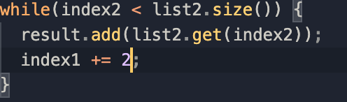
Doing this means the correct index value incremented, so the while loop will iterate through list2 as intended. Furthermore, this means the while loop will now stop at a certain point, and not try to get into additional memory. Running the tests with this bug fixed, results in the test being succesful. 
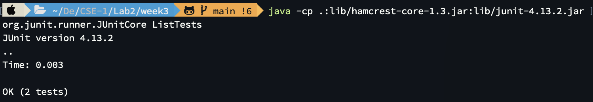