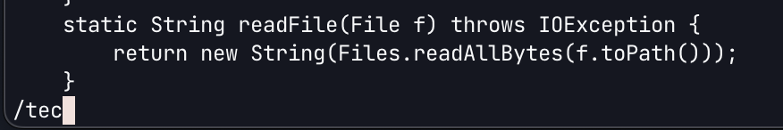
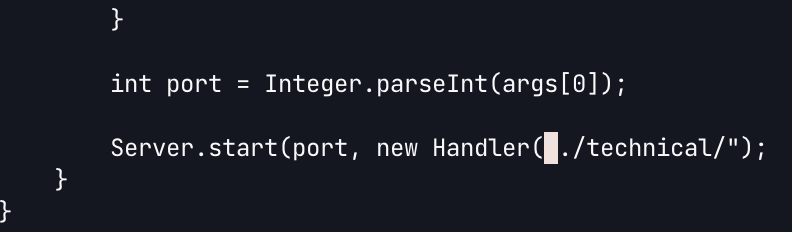
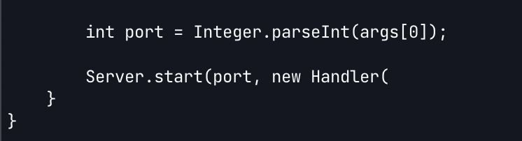
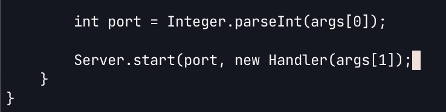
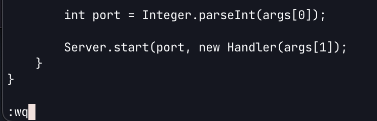

# Lab Report 4 - Vim
## Part 1
---
### Task 3
In this task, we are trying to change line 74 on **DocSearchServer.java** by replacing `"./technical/"` with code so that the main function can take the file path using the second command-line argument. 
This is the sequence of commands it took to make this exit and exit the changed file. 
`/tec<Enter>3hd3wi<right arrow>args[1]));<esc>:wq<Enter>`
This took a total of 27 key presses, plus another 7 if you wanted to count opening the file. However, in terms of simply editing the file and saving the changes, it could be done in under 30 keystrokes. 
After opening the file, the first move is to search using `/tec<Enter>`, which will take the cursor to the letter `t` in the technical we want to change.

While you could search for `"./` to get closer to the beginning on the expression you want to delete, the search doesn't immediately take you to that instance, so this seems to be the fastest way of getting to line 74. 

From there, I used `3h` to move the cursor to the first quotation mark a the beginning of `"./technical/"`. Using `3h` saves 1 keystroke from having to press `h` 3 times. 

Afterwards, I used `d3w` to delete the expression `"./technical")`, and then enter Insert mode using `i` and `<right arrow>` to move the cursor right after the opening paranthesis. 

From there, I had to type out the expression `args[1]));` which cannot be shortened, but that is enough to change the main method so that it takes the file path dynamically using the second command line argument. 

Finally, I used `<esc>:wq` to exit Insert mode, and then save the changes in the file and exit vim.

---
## Part 2
### Editing in Visual Studio Code and scp the file onto remote 
In this case, where I had to make the changes on Visual Studio code, and then `scp` the file onto the remote server, move into the correct directory, and run the script file, the total process took about **36** seconds.
Some things I noticed was that it was a lot more intuitive for me to navigate to the correct location in the file that I wanted to change, and I could very quickly highlight and delete whatever text I wanted to. However, I did start with Visual Studio Code pretty much open already, so manually navigating to which directory I wanted to open is something that would take less time using the command line. 

### Making the change in ssh with Vim
In this case, where I started logged into an ssh session, moved into the correct directory, opened the file in Vim, made the changes to the file, saved the changes and exited the file, and then ran the script file, the total process to about **28** seconds. 
Some things I noticed was that it was very easy to navigate to the file I wanted to change, but the only reason that making the actual edits was faster was because I was so familiar with the commands I needed to do. I think the time it would take to scp the file and then log into an ssh session is neglibible, but only if you're making one change. 

Of these two styles, if I was working on the remote server, I think using solely Vim is preferable, since the changes could be made much more quickly, and the constant need to scp files would add up over time. Although you could just keep two command-line sessions open, with one on the local and one on the remote, with Visual Studio Code open with the files you are working on, it would be easier to just use Vim on the remote server if the changes you are making are small. 
However, if you are working on a larger project across multiple files, I would say being able to quickly move between files, and view them without having to open and close files repeatedly makes the first style preferable in these cases. 
I would say that if I knew the changes I needed to make to the files would be relatively quick, then I might prefer using Vim. However, in terms of speed and efficiency, it requires the user to be very comfortable with Vim commands, and it may even distract them from the work they are trying to do if they have to think about simply moving the cursor around and editing text. 