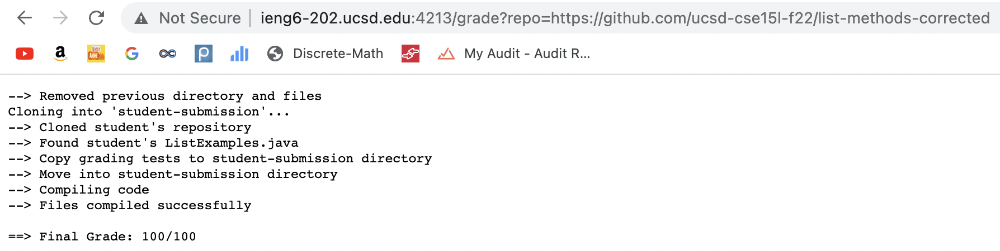
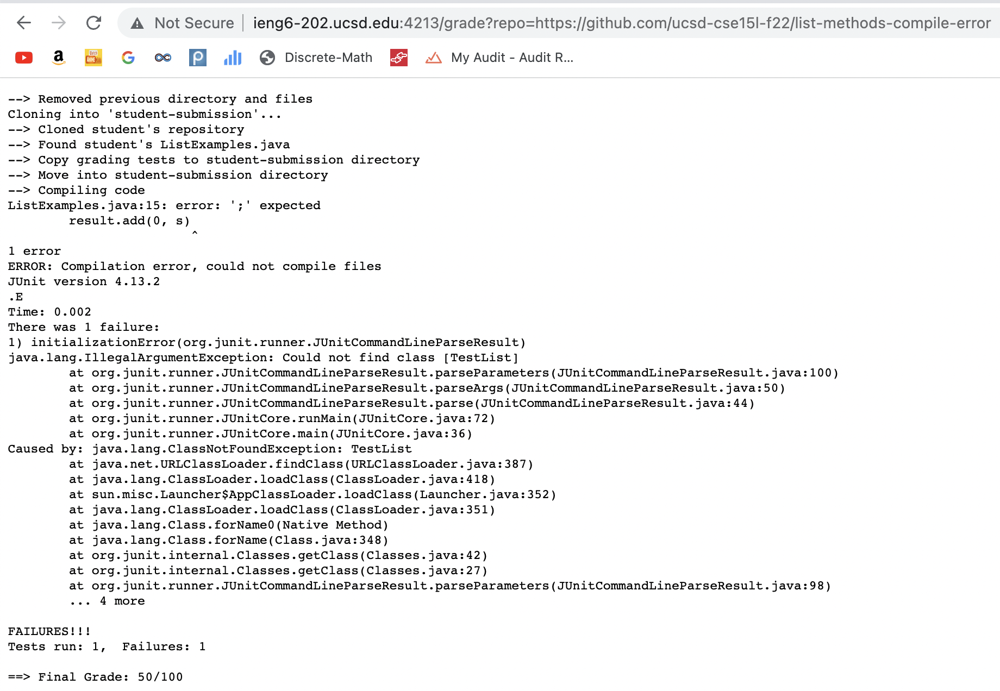
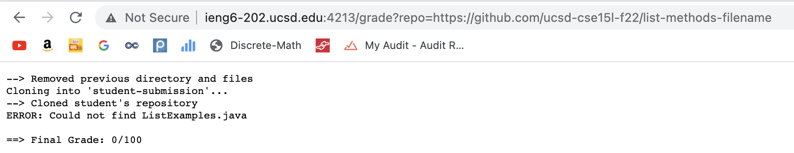

# Lab Report 5
## Grading Script
```
# Create your grading script here

# Script variables
CORE_PATH=lib/hamcrest-core-1.3.jar
JUNIT_PATH=lib/junit-4.13.2.jar

REPO_PATH=student-submission
TEST_FILE=ListExamples.java
GRADE_FILE=TestListExamples

TEST_COUNT=2
GRADE=0
ERROR=0

# Remove previous directory and remaining files from previous compilation
rm -rf $REPO_PATH
echo "--> Removed previous directory and files"

# Clone the student's repository
git clone $1 $REPO_PATH
if [[ $? -ne 0 ]]
then
    echo "ERROR: Could not clone the student's repository"
    echo -e "\n==> Final Grade: 0/100"
    exit 1
fi
echo "--> Cloned student's repository"

# Check if the student has a ListExamples.java file
if [[ ! -f $REPO_PATH/$TEST_FILE ]]
then
    echo "ERROR: Could not find $TEST_FILE"
    echo -e "\n==> Final Grade: 0/100"
    exit 1
fi
echo "--> Found student's $TEST_FILE"

# Copy grading files and libraries into the directory of the student's repository
echo "--> Copy grading tests to student-submission directory"
mkdir $REPO_PATH/lib
cp lib/* $REPO_PATH/lib
cp *.java $REPO_PATH

# Move into the student's submission directory
echo "--> Move into student-submission directory"
cd $REPO_PATH

# Compile the student's code
echo "--> Compiling code"
javac -cp .:$CORE_PATH:$JUNIT_PATH *.java > compile.txt
if [[ $? -ne 0 ]]
then
        echo "ERROR: Compilation error, could not compile files"
        cat compile.txt
else
        echo "--> Files compiled successfully"
fi

java -cp .:$CORE_PATH:$JUNIT_PATH org.junit.runner.JUnitCore $GRADE_FILE > junit.txt

# Grade the student's code
if [[ $? -eq 0 ]]
then
    GRADE=100
else
    echo "$(<junit.txt)"
    cat junit.txt | head -n 2 | tail -n 1 > grades.txt
    ERROR=$(grep -o 'E' grades.txt | wc -l | xargs)
    GRADE=$(( 100 - ($ERROR * 100 / $TEST_COUNT) ))
fi

# Print final grade
echo -e  "\n==> Final Grade: $GRADE/100"
```
## Screenshots of script running
### Correct Submission

Repository used: https://github.com/ucsd-cse15l-f22/list-methods-corrected
### Syntax Error Submission

Repository used: https://github.com/ucsd-cse15l-f22/list-methods-compile-error
### Filename Error Submission

Repository used: https://github.com/ucsd-cse15l-f22/list-methods-filename

---
## Tracing the Script
The repository I will trace will be the one with all correct methods (Repository: https://github.com/ucsd-cse15l-f22/list-methods-corrected).
Starting on line 16, as it has the first command outside of variable declaration

LINE 16 `rm -rf $REPO_PATH`

error code: 0, stdout: , stderr: 

LINE 17 `echo "--> Removed previous directory and files"`

error code: 0, stdout: --> Removed previous directory and files, stderr: 

LINE 20 `git clone $1 $REPO_PATH`

error code: 0, stdout: , stderr: 

LINE 21 `if [[ $? -ne 0 ]]`

This if statement is false, since the script was able to clone the repository, so the previous command's exit code $? was 0.

LINE 23 `echo "ERROR: Could not clone the student's repository"`

This line does not run.

LINE 24 `echo -e "\n==> Final Grade: 0/100"`

This line does not run.

LINE 25 `exit 1`

This line does not run.

LINE 27 `echo "--> Cloned student's repository"`

error code: 0, stdout: --> Cloned student's repository, stderr: 

LINE 30 `if [[ ! -f $REPO_PATH/$TEST_FILE ]]`

This if statement is false, since the script was able to find the ListExamples.java file.

LINE 32 `echo "ERROR: Could not find $TEST_FILE"`

This line does not run.

LINE 33 `echo -e "\n==> Final Grade: 0/100"`

This line does not run.

LINE 34 `exit 1`

This line does not run.

LINE 36 `echo "--> Found student's $TEST_FILE"`

error code: 0, stdout: --> Found student's ListExamples.java, stderr: 

LINE 39 `echo "--> Copy grading tests to student-submission directory"`

error code: 0, stdout: --> Copy grading tests to student-submission directory, stderr: 

LINE 40 `mkdir $REPO_PATH/lib`

error code: 0, stdout: , stderr: 

LINE 41 `cp lib/* $REPO_PATH/lib`

error code: 0, stdout: , stderr: 

LINE 42 `cp *.java $REPO_PATH`

error code: 0, stdout: , stderr: 

LINE 45 `echo "--> Move into student-submission directory"`

error code: 0, stdout: --> Move into student-submission directory, stderr: 

LINE 46 `cd $REPO_PATH`

error code: 0, stdout: , stderr: 

LINE 49 `echo "--> Compiling code"`

error code: 0, stdout: --> Compiling code, stderr: 

LINE 50 `javac -cp .:$CORE_PATH:$JUNIT_PATH *.java > compile.txt`

error code: 0, stdout: , stderr: 

LINE 52 `if [[ $? -ne 0 ]]`

This line does not run since the files were able to compile, so the previous command's exit code is 0.

LINE 53 `echo "ERROR: Compilation error, could not compile files"`

This line does not run.

LINE 54 `cat compile.txt`

This line does not run.

LINE 56 `echo "--> Files compiled successfully"`

error code: 0, stdout: --> Files compiled successfully, stderr: 

LINE 59 `java -cp .:$CORE_PATH:$JUNIT_PATH org.junit.runner.JUnitCore $GRADE_FILE > junit.txt`

error code: 0, stdout: , stderr: 

LINE 62 `if [[ $? -eq 0 ]]`

This if statement is true, since the files were able to compile, so the return code of the previous code was 0.

LINE 54 `GRADE=100`

This line will run, setting the grade to 100.

LINE 65 `echo "$(<junit.txt)"`

This statement will not run since the previous if conditional is correct. 

LINE 66 `cat junit.txt | head -n 2 | tail -n 1 > grades.txt`

This line does not run.

LINE 67 `ERROR=$(grep -o 'E' grades.txt | wc -l | xargs)`

This line does not run.

LINE 68 `GRADE=$(( 100 - ($ERROR * 100 / $TEST_COUNT) ))`

This line does not run.

LINE 73 `echo -e  "\n==> Final Grade: $GRADE/100"`

error code: 0, stdout: ==> Final Grade: $GRADE/100, stderr: 

